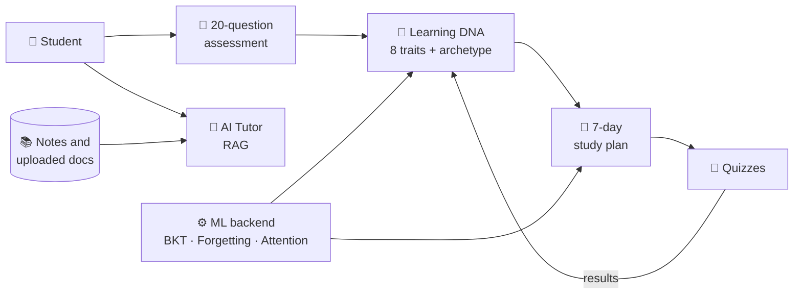

<p align="center">
  
</p>

<p align="center">
  
</p>

<p align="center">
  
  
  
  
</p>

<p align="center">
  <a href="mailto:itsvibhav1307@gmail.com"></a>
  <a href="https://github.com/Vibhavraju?tab=repositories"></a>
  <a href="https://github.com/Vibhavraju/LearningDNA-AI"></a>
</p>

---

## 👨‍🎓 About Me

```yaml
name:        Vibhav Raju
studying:    B.Tech CSE (Data Science)
focus:       [AI, Machine Learning, Generative AI]
building:    [RAG systems, LLM apps, AI agents, full-stack products]
learning:    [System design, MLOps, Cloud deployment, Deep learning]
open_to:     [AI/ML collaborations, projects, internships]
reach_me:    itsvibhav1307@gmail.com
motto:       "Learn · Build · Experiment · Repeat"
```

---

## 🧰 Tech Stack

### 💻 Languages
<p>
  
</p>

### 🌐 Frontend & Backend
<p>
  
</p>

### 🗄 Databases & Infrastructure
<p>
  
</p>

### 🛠 Tools & Analytics
<p>
  
</p>

### 🤖 AI / ML Toolkit


### ⚙️ Engineering Practices


---

## 🎯 What I Can Build

| 🧩 Area | 💡 What I do | 🔧 Tools |
|---|---|---|
| **AI Applications** | Personalised, adaptive apps that react to user behaviour | Python, FastAPI, React |
| **LLM & RAG Systems** | Tutors and chatbots that answer from your own documents | RAG, Ollama, LLM APIs |
| **Machine Learning** | Classifiers, knowledge tracing, learner modelling | scikit-learn, NumPy, SciPy |
| **Full-Stack Web** | Responsive UIs with clean, tested APIs | React, TypeScript, Tailwind |
| **Data & Analytics** | Dashboards and insights from raw data | SQL, Pandas, Power BI |
| **DevOps Basics** | Containerised apps with automated tests and CI | Docker, GitHub Actions |

---

## 🚀 Featured Project

<table>
<tr>
<td>

### 🧬 [Learning DNA AI](https://github.com/Vibhavraju/LearningDNA-AI)
**An AI learning app that works out *how* you learn, then adapts your study plan and tutor to match.**

- 📝 **20-scenario assessment** → 8-trait Learning DNA, DNA code and archetype
- 📅 **7-day study plan** that updates as quiz results come in
- 🧠 **ML engine:** Bayesian Knowledge Tracing, forgetting curve, attention change-point detection, learner-type classifier
- 🤖 **RAG AI Tutor** with a mock / Anthropic / Ollama provider switch and offline fallback
- 🔌 **FastAPI backend** with REST + WebSocket live updates and PNG/PDF DNA card export
- ✅ **Tested and automated:** pytest, vitest, ruff, ESLint, GitHub Actions, Docker Compose


</td>
</tr>
</table>

### 🏗 How it works



---

## 📂 More Projects

| Project | What it does | Focus |
|---|---|---|
| 📱 **AI Phone Usage Control** | Intelligent screen-time management | AI · Behaviour analysis |
| 🌱 **Smart Irrigation** | IoT-based automated irrigation | IoT · Automation |
| 📧 **Spam Email Detection** | Machine learning spam classifier | ML · NLP |
| 💬 **Local AI Chatbot** | Chatbot using an LLM running locally | LLM · Ollama |

👉 [Browse all my repositories](https://github.com/Vibhavraju?tab=repositories)

---

## 📊 GitHub Analytics

<p align="center">
  
  
</p>

<p align="center">
  
</p>

<p align="center">
  
</p>

<p align="center">
  
</p>

---

## 🗺 My Roadmap

- [x] Core programming: Python, Java, SQL, DSA
- [x] Machine Learning fundamentals and classic ML projects
- [x] Full-stack project with an ML backend (Learning DNA AI)
- [x] Testing, CI and Docker basics
- [ ] Deep learning: train and compare DKT / LSTM models
- [ ] Production-grade AI apps: authentication and database persistence
- [ ] Cloud deployment (AWS / Azure)
- [ ] Multi-agent AI systems
- [ ] Contribute to open source

---

## 🤝 Let's Collaborate

I'm happy to team up on **AI / ML, LLM, RAG and full-stack projects**. If you have an idea, message me!

<p align="center">
  <a href="mailto:itsvibhav1307@gmail.com"></a>
</p>

<p align="center">
  
</p>

<p align="center">
  
</p>
